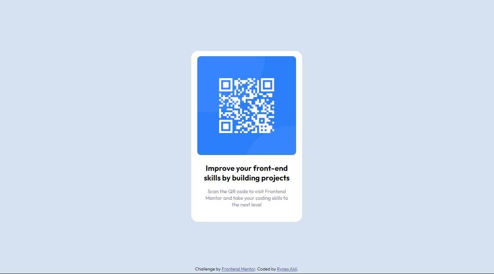

# Frontend Mentor - QR code component solution

This is a solution to the [QR code component challenge on Frontend Mentor](https://www.frontendmentor.io/challenges/qr-code-component-iux_sIO_H). Frontend Mentor challenges help you improve your coding skills by building realistic projects. 

## Table of contents

- [Overview](#overview)
  - [Screenshot](#screenshot)
  - [Links](#links)
- [My process](#my-process)
  - [Built with](#built-with)
  - [What I learned](#what-i-learned)
  - [Continued development](#continued-development)
  - [Useful resources](#useful-resources)
- [Author](#author)
- [Acknowledgments](#acknowledgments)

## Overview

  ### Screenshot

  

  ### Links

  - Solution URL: [Add solution URL here](https://codepen.io/rynex-zv/pen/poVNMNy)

## My process

  ### Built with

  - Semantic HTML5 markup
  - SCSS Superstar custom properties
  - Flex
  - vsCode

  ### What I learned

  -I can add a div to make a small spacing below element without effecting above elements.
  -It's better to add main and footer tags  

  ### Continued development

  -positioning stuff is super hard! still need to work on it.

  ### Useful resources

  - [PerfectPixel](https://chrome.google.com/webstore/detail/perfectpixel-by-welldonec/dkaagdgjmgdmbnecmcefdhjekcoceebi) - This helped me for making a good moves with positioning elements. I really liked this extension and will use it going forward.

## Author

  - LinkedIn - [Rynex Akil](https://www.your-site.com)
  - Frontend Mentor - [@rynex-zv](https://www.frontendmentor.io/profile/rynex-zv)

## Acknowledgments

  - [Kevin Powell](https://www.youtube.com/kepowob)